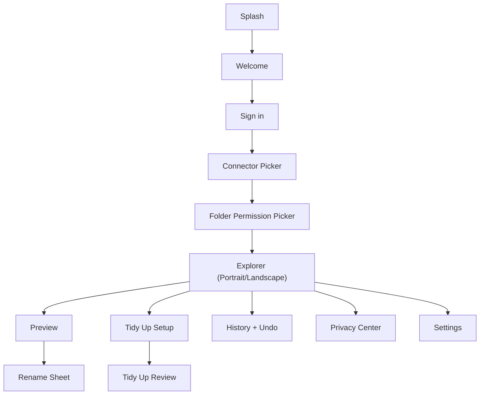

# Layout Spec: Mobile File Tidy Assistant

Last updated: 2026-03-28
Source alignment: `intend.md`

## 1) Screen map (V1)
1. Splash
2. Welcome / Onboarding
3. Sign in / Connect account
4. Connector picker
5. Folder permission picker
6. Explorer (Portrait)
7. Explorer (Landscape split view)
8. File Preview (Portrait full screen)
9. Rename sheet (Manual + AI tab)
10. Tidy Up setup
11. Tidy Up review results
12. History + Undo
13. Privacy Center
14. Settings (Plan, Logout, Delete data)

## 2) Main navigation flow


## 3) Wireframe layouts

### 3.1 Explorer (Portrait)
```text
+--------------------------------------------------+
| [Search files/folders]                    [Menu] |
| Source: Phone / Drive / Dropbox                 |
+--------------------------------------------------+
| Folder breadcrumb: Home > Travel > Japan        |
+--------------------------------------------------+
| [Folder] Day 1                                  |
| [Folder] Day 2                                  |
| [PDF]    Ticket_final_v3.pdf                    |
| [IMG]    IMG_4582.jpg                           |
| [DOC]    Notes.docx                             |
| ...                                              |
+--------------------------------------------------+
| [Tidy Up] [History] [Privacy] [Settings]        |
+--------------------------------------------------+
Tap file -> opens File Preview full screen
```

### 3.2 Explorer (Landscape split)
```text
+----------------------------+---------------------+
| LEFT: Browser              | RIGHT: Preview      |
| [Search]           [Menu]  | File name           |
| Breadcrumb                 | ------------------- |
| [Folder] Day 1             | Document/Image view |
| [Folder] Day 2             |                     |
| [PDF] ticket.pdf           |                     |
| [IMG] IMG_4582.jpg         |                     |
| ...                        |                     |
|                            | [Rename] [Tidy Up]  |
+----------------------------+---------------------+
Default split ratio: 40% left / 60% right
```

### 3.3 File Preview (Portrait full screen)
```text
+--------------------------------------------------+
| [Back] FileName.pdf                      [More]  |
+--------------------------------------------------+
|                                                  |
|                Document/Image Preview            |
|                                                  |
+--------------------------------------------------+
| [Rename] [Tidy Up this folder] [Share(optional)] |
+--------------------------------------------------+
```

### 3.4 Rename Sheet
```text
+--------------------------------------------------+
| Rename File                                      |
| [Manual] [AI Suggest]                            |
|--------------------------------------------------|
| Manual:                                          |
| New name: [__________________________]           |
|                                                  |
| AI Suggest:                                      |
| 1) 2025-11-Steve-Contract.pdf     [Use]          |
| 2) Steve_Contract_Nov_2025.pdf    [Use]          |
| 3) Contract_Steve_2025-11.pdf     [Use]          |
|                                                  |
| [Cancel]                           [Confirm]     |
+--------------------------------------------------+
Rules: never auto-rename without Confirm
```

### 3.5 Tidy Up setup
```text
+--------------------------------------------------+
| Tidy Up Folder                                   |
| Folder: /Travel/Japan                            |
|--------------------------------------------------|
| Mode: ( ) Non-AI  ( ) AI                         |
| Rename style: [Date + Place + Sequence v]        |
| Include summary after tidy: [ON/OFF]             |
| Preview 24 changes                               |
|                                                  |
| [Cancel]                        [Run Tidy Up]    |
+--------------------------------------------------+
```

### 3.6 Tidy Up review results
```text
+--------------------------------------------------+
| Review Changes                                   |
| 24 file names suggested                          |
|--------------------------------------------------|
| IMG_4582.jpg  ->  2025-11-08-Kyoto-001.jpg      |
| IMG_4583.jpg  ->  2025-11-08-Kyoto-002.jpg      |
| ...                                              |
|                                                  |
| Summary (optional): "Kyoto day 1 photos"         |
|                                                  |
| [Back]                    [Approve and Apply]    |
+--------------------------------------------------+
```

### 3.7 History + Undo
```text
+--------------------------------------------------+
| History                                          |
|--------------------------------------------------|
| 10:42  ticket_final_v3.pdf -> 2025-11-ticket.pdf|
| 10:41  IMG_4582.jpg -> 2025-11-08-Kyoto-001.jpg |
| ...                                              |
|                                                  |
| Select item: [Undo rename]                       |
+--------------------------------------------------+
```

### 3.8 Privacy Center
```text
+--------------------------------------------------+
| Privacy Center                                   |
|--------------------------------------------------|
| Processing mode: [Manual | Semi-auto]           |
| Connected: Google Drive, Dropbox                 |
| Allowed folders: 3                               |
| AI usage: ON/OFF                                 |
| Data sent for AI: "snippet only"                 |
|                                                  |
| [Manage folders] [Disconnect account]            |
| [Delete my app data]                             |
+--------------------------------------------------+
```

### 3.9 Settings
```text
+--------------------------------------------------+
| Settings                                         |
|--------------------------------------------------|
| Plan: Free / Pro Local / Pro AI add-on           |
| Manage subscription                              |
| Senior simple mode [ON/OFF]                      |
| USB Archive tools                                |
| Logout                                           |
+--------------------------------------------------+
```

## 4) Shared layout templates (reusable)
1. Setup template: onboarding, connect, permissions.
2. Workbench template: browser + preview (portrait/split landscape).
3. Action sheet template: rename, tidy options, confirmations.
4. Management template: history, privacy, settings.

## 5) Core reusable components
- `AppTopBar`
- `SourceSwitcher`
- `BreadcrumbBar`
- `FileListItem`
- `PreviewPane`
- `PrimaryButton`, `SecondaryButton`
- `RenameSheet`
- `TidySetupCard`
- `HistoryRow`
- `PrivacyToggleRow`
- `LottieSlot` (central animation component)

## 6) Responsive behavior (locked)
- Portrait: one-pane workflow.
- Landscape: split-pane workflow by default.
- Split ratio starts at 40/60 and can be adjusted later.
- Touch targets must stay large for older users.
